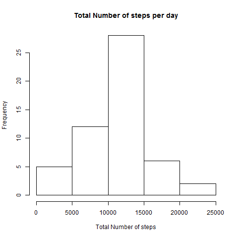
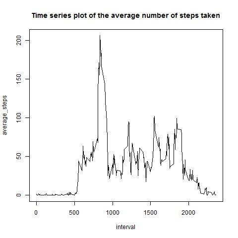
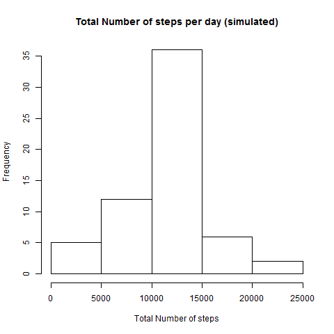
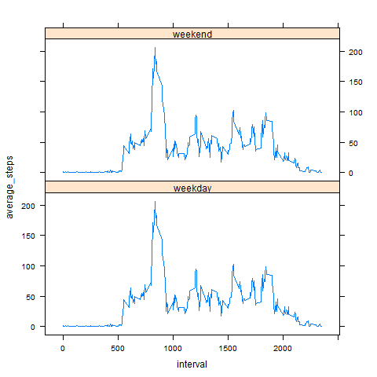

Coursera: Reproducible Research - Peer Assignment 1 (May 2014)
==============================================================
```{r}
# Sys.getlocale(category = "LC_ALL")
Sys.setlocale("LC_TIME", 'English_US')
```

## Loading and preprocessing the data

### Load the data
``` {r}
activity_original <- read.csv("./activity.csv",sep=",",header=TRUE, quote="", strip.white=TRUE, stringsAsFactors=FALSE, col.names=c("steps","date","interval"))
## activity$date <- as.Date(activity$date,format="%Y-%m-%d")
```
### Process/transform the data (if necessary) into a format suitable for your analysis
```{r}
activity <- activity_original[!is.na(activity_original$steps),]
## head(activity)
## activity$date <- as.Date(activity$date,format="%Y-%m-%d")
```


## What is mean total number of steps taken per day?
### Make a histogram of the total number of steps taken each day

``` {r}
library(data.table)
ActTable <- data.table(activity)
## names(ActTable)
ActTotalPerDayTable <- ActTable[,sum(steps),by=date]
setNames(ActTotalPerDayTable,c("date","total_steps"))
png(filename="./figures/TotalStepsPerDayHist.png", width=480,height=480)
hist(ActTotalPerDayTable$total_steps, main="Total Number of steps per day", xlab="Total Number of steps",)
# dev.copy(png, file = "./figures/TotalStepsPerDayHist.png")
dev.off()
```
 


### Calculate the *mean* and *median* total number of steps taken per day

``` {r}
summary(ActTotalPerDayTable)
```

## What is the average daily activity pattern?

### Make a time series plot of the 5-minute interval (x-axis) and the average number of steps taken, averaged across all days (y-axis)
```{r}
ActTMeanPer5minTable <- ActTable[,mean(steps),by=interval]
setNames(ActTMeanPer5minTable,c("interval","average_steps"))
png(filename="./figures/AvgStepsPerInterval.png", width=480,height=480)
plot(ActTMeanPer5minTable, type="l",main="Time series plot of the average number of steps taken")
# dev.copy(png, file = "./figures/AvgStepsPerInterval.png")
dev.off()
```

 

### Which 5-minute interval, on average across all the days in the dataset, contains the maximum number of steps?
```{r}
summary(ActTMeanPer5minTable)
indexMax <- ActTMeanPer5minTable[,which.max(average_steps)]
ActTMeanPer5minTable[indexMax,]
```

## Imputing missing values

Note that there are a number of days/intervals. The presence of missing days may introduce bias into some calculations or summaries of the data.

### Calculate and report the total number of missing values in the dataset

```{r}
table(is.na(activity_original$steps))
```

### Devise a strategy for filling in all of the missing values in the dataset. 
The missing data will be replaced by the mean of the same 5 minute interval.

### Create a new dataset that is equal to the original dataset but with the missing data filled in.

```{r}
meanPerInterval <- as.data.frame(ActTMeanPer5minTable[,])
names(meanPerInterval)
activity_filled <- merge(x=activity_original,y=meanPerInterval, by.x="interval",all = TRUE)
names(activity_filled)
activity_filled$steps[is.na(activity_filled$steps)] <- activity_filled$average_steps[is.na(activity_filled$steps)]
head(activity_filled)
```

### Make a histogram of the total number of steps taken each day 
```{r}
FilledTable <- data.table(activity_filled)
ActTotalPerDayFilledTable <- FilledTable[,sum(steps),by=date]
setNames(ActTotalPerDayFilledTable,c("date","total_steps"))
png(filename="./figures/TotalStepsPerDaySimulatedHist.png", width=480,height=480)
hist(ActTotalPerDayFilledTable$total_steps, main="Total Number of steps per day (simulated)", xlab="Total Number of steps",)
# dev.copy(png, file = "./figures/TotalStepsPerDaySimulatedHist.png")
dev.off()
```

 

### Calculate and report the mean and median total number of steps taken per day. 
``` {r}
summary(ActTotalPerDayFilledTable)
```


### Do these values differ from the estimates from the first part of the assignment? 
Without missing values:
- Median :10765  
- Mean   :10766  


By Imputing missing values with the mean of the 5 minute interval:
- Median :10766  
- Mean   :10766  

### What is the impact of imputing missing data on the estimates of the total daily number of steps?
By Imputing missing values with the mean of the 5 minute interval **the value of median gets equal to the value of mean**.

## Are there differences in activity patterns between weekdays and weekends?

Use the dataset with the filled-in missing values for this part.

### Create a new factor variable in the dataset with two levels – “weekday” and “weekend” indicating whether a given date is a weekday or weekend day.
```{r}
# activity_filled$DayType <- strftime((strptime(as.character(activity_filled$date),format="\"%Y-%m-%d\"")),format="%A")
activity_filled$DayType <- weekdays(strptime(as.character(activity_filled$date),format="\"%Y-%m-%d\""))

head(activity_filled)
activity_filled$DayType[activity_filled$DayType %in% c("Saturday","Sunday")] <- "weekend"
activity_filled$DayType[!(activity_filled$DayType %in% c("weekend"))] <- "weekday"
head(activity_filled)
activity_filled$DayType <- as.factor(activity_filled$DayType)
summary(activity_filled)
```

### Make a panel plot containing a time series plot of the 5-minute interval (x-axis) and the average number of steps taken, averaged across all weekday days or weekend days (y-axis).
```{r}
library(lattice)
png(filename="./figures/AvgStepsWeekendsVsWeekdays.png", width=480,height=480)
xyplot(average_steps ~ interval | DayType, data = activity_filled, type="l",layout = c(1, 2))
# dev.copy(png, file = "./figures/AvgStepsWeekendsVsWeekdays.png")
dev.off()
```

 
